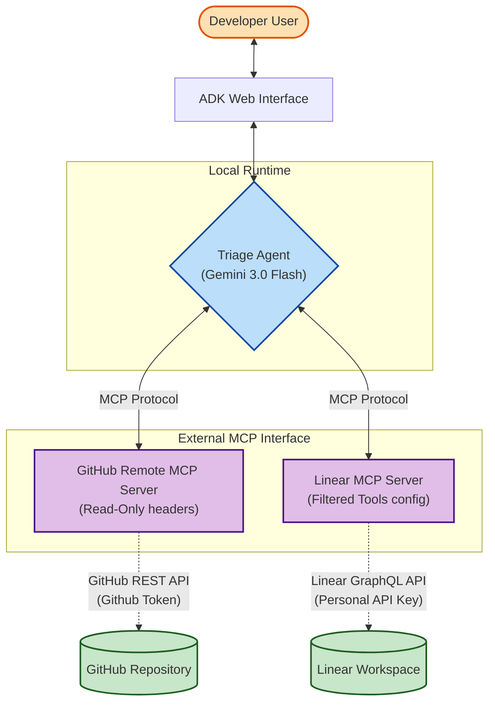

# Multi-Server MCP Architecture

The following diagram illustrates the communication flow of our cross-platform triage agent:

## Communication Flow

1. **User Input:** The developer provides a prompt containing the Linear Bug ID and the target repository to the Triage Agent via the ADK Interface.
2. **Context Resolution:** The Agent formulates a tool call over the standard Model Context Protocol (MCP) stream boundary to the `Linear MCP Server`. 
3. **Extraction:** The Linear Server fetches the live ticket via GraphQL and returns the text body back to the Agent.
4. **Cross-Reference:** The Agent extracts keywords from the ticket response and immediately submits a second, distinct set of MCP tool calls to the `GitHub Remote MCP Server`.
5. **Diff Analysis:** The GitHub Server leverages the GitHub REST API (constrained by read-only headers from the Agent's initial connection negotiation) to locate and download the source diff.
6. **Synthesis:** The Agent synthesizes both datastreams into a single summarized markdown table for the User.
